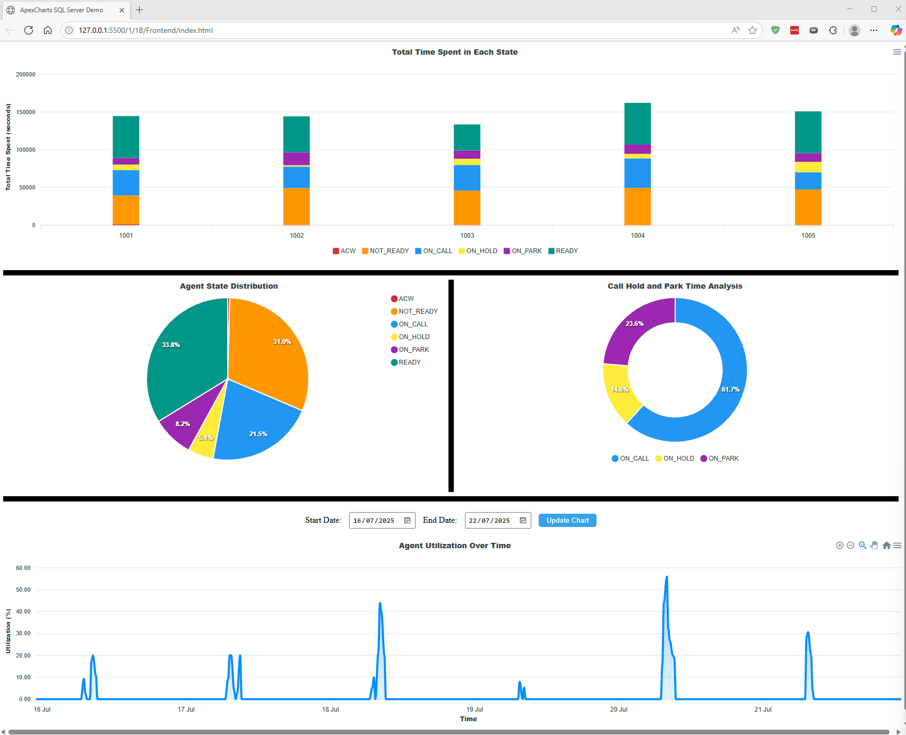

1. Below can be seen a screenshot of the visualization.
Each graph adds its unique perspective to the data, allowing for a comprehensive understanding of the trends and patterns. 
    **Graph 1**:
    This bar chart compares individual agents’ time spent in each state. It identifies high-performing agents (e.g., those with high ON_CALL time) and those needing coaching (e.g., excessive NOT_READY time). Managers can use it to address performance disparities, optimize training, and ensure balanced workloads, enhancing overall team efficiency and customer service quality. 
    **Graph 2**:
    This pie chart shows how agent time is split across states (e.g., ON_CALL, NOT_READY, READY) over a period. It highlights inefficiencies (e.g., high NOT_READY time), guides staffing decisions (e.g., high READY vs. ON_CALL), and flags customer experience issues (e.g., excessive ON_HOLD). Its clear, visual format aids quick identification of performance gaps and supports data-driven coaching or scheduling adjustments. 
    **Graph 3**:
    This doughnut chart displays the proportion of time agents spend in ON_HOLD and ON_PARK states compared to ON_CALL. It highlights inefficiencies in call handling, as excessive hold or park times can frustrate customers and increase call abandonment rates. Managers can use it to identify agents or processes causing delays, implement training to reduce hold times, and improve customer experience by ensuring faster issue resolution. 
    **Graph 4**:
    This line chart tracks the percentage of time agents spend in productive states (ON_CALL, ACW, ON_HOLD) versus total time. It reveals peak and low utilization periods, helping managers optimize scheduling, address underperformance, and ensure efficient resource use. This supports improved call handling capacity and customer service by aligning staffing with demand. 
     
     
2. The storage procedure that retrieves the data for the visualization is on 1B/Backend/sp_GetAgentStateIntervals.sql 
 
3. The code that handles the visualization is in 1B/Frontend 
 
4. There always things that can be improved. In this case, I would like to add a feature that allows the user to filter the data by date range or specific agents. This would enable more targeted analysis and help identify trends over time or performance issues with individual agents.
But regardless of what could be done, I believe that the most important thing is to be aligned with what the user is looking for, there is no point in adding features that the user does not need or want.